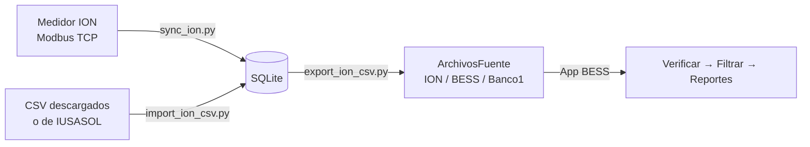

# Guía de scripts — Lectura ION y perfiles BESS

Proyecto: `C:\BESS`  
Base de datos: `C:\BESS\data\bess_perfiles.db`  
CSV destino: `C:\BESS\data\ArchivosFuente\`

---

## Resumen

| Script | Función |
|--------|---------|
| `dist/descargar_ion.exe` | **Ejecutable standalone** — descarga perfil ION a CSV (ver `docs/DESCARGAR_ION.md`) |
| `scripts/descargar_ion.py` | Mismo flujo que el `.exe`, vía Python |
| `scripts/lee_ion.py` | Lectura Modbus ION 8650 (diagnóstico y descarga CSV) |
| `scripts/sync_ion.py` | Sincronización incremental ION → SQLite |
| `scripts/import_perfil_csv.py` | Importar CSV históricos → SQLite |
| `scripts/export_perfiles.py` | Exportar SQLite → CSV ArchivosFuente |
| `scripts/sincronizar_perfiles.py` | **Orquestador diario** (ION + API + export) |

**Base de datos:** `C:\BESS\data\bess_perfiles.db`  
**Dependencia:** `pymodbus>=3.6.0` (`pip install -r requirements.txt`)

---

## Flujo recomendado



**Operación diaria típica:**

```powershell
cd C:\BESS
python scripts\sincronizar_perfiles.py
```

Luego en la app BESS: **Verificar → Filtrar → Generar reportes**.

---

## Configuración del medidor

Valores definidos en `LeeIONTestigo.py` (editar el archivo si cambian):

| Parámetro | Default | Descripción |
|-----------|---------|-------------|
| `--ip` | `172.16.111.209` | IP del medidor ION (Modbus TCP) |
| `--puerto` | `502` | Puerto Modbus TCP |
| `--modulo-dr` | `1` | Módulo Data Recorder en ION Setup |
| `--modulo-dr` | `1` | Número de módulo Data Recorder |
| `--sources` | `6` | Canales de energía (sin Source_7) |
| `--tz` | `America/Mexico_City` | Zona horaria del timestamp |
| `NOMBRES_SOURCES` | KWH_REC, KWH_ENT, KVARH_Q1–Q4 | Canal 1 del DR → **KWH_REC** (desde descarga/sync) |

**Mapeo en origen:** la función `mapear_sources_bess()` en `LeeIONTestigo.py` asigna cada source del Data Recorder a la columna BESS correcta. Aplica en `--modo descargar` y en `sync_ion.py`. No hace falta post-procesar columnas KWH para datos nuevos.

**Direccionamiento Modbus:** Schneider documenta registros como `43xxx`; pymodbus usa `registro - 40001` (ej. `43001` → dirección `3000`).

---

## 1. LeeIONTestigo.py

Lectura Modbus del medidor Schneider ION 8650. Soporta mediciones instantáneas y perfil histórico del Data Recorder.

### Sintaxis general

```powershell
python scripts/lee_ion.py [--modo MODO] [opciones]
```

### Modos (`--modo`)

| Modo | Descripción |
|------|-------------|
| `instantaneas` | **(default)** Lee parámetros en vivo del mapa Modbus Default (kW, kWh, voltajes, etc.) |
| `default` | Igual que `instantaneas` |
| `listar` | Lista parámetros del mapa Modbus CSV (no requiere conexión al medidor) |
| `param` | Lee un parámetro específico por nombre |
| `escanear` | Busca módulos Data Recorder activos en el medidor |
| `recorder` | Muestra el último registro del Data Recorder (diagnóstico) |
| `descargar` | Descarga perfil de carga a CSV |

### Opciones comunes

| Opción | Default | Descripción |
|--------|---------|-------------|
| `--modo` | `instantaneas` | Modo de operación (ver tabla anterior) |
| `--mapa` | `modbus_map_default.csv` | Ruta al mapa Modbus Schneider |
| `--modulo-dr` | `1` | Número de módulo Data Recorder |
| `--sources` | `6` | Cantidad de sources/canales a leer |
| `--tz` | `America/Mexico_City` | Zona horaria para columna `Fecha` |
| `--int32` | *(off)* | Decodificar sources como int32 (default: float32) |
| `--ip` | `172.16.111.209` | IP del medidor ION |
| `--puerto` | `502` | Puerto Modbus TCP |

### Opciones para perfil (`recorder`, `descargar`, `escanear`)

| Opción | Default | Descripción |
|--------|---------|-------------|
| `--cantidad` | `10` | Últimos N registros (solo sin `--desde`/`--hasta`) |
| `--desde` | — | Fecha inicio: `YYYY-MM-DD` o `YYYY-MM-DD HH:MM:SS` |
| `--hasta` | — | Fecha fin inclusive (mismo formato) |
| `--salida` | auto | Ruta del CSV de salida |

### Opciones para mapa Modbus (`listar`, `param`)

| Opción | Descripción |
|--------|-------------|
| `--filtro` | Texto para filtrar parámetros (modo `listar`) |
| `--nombre` | Nombre exacto del parámetro (modo `param`) |

### Ejemplos

```powershell
# Mediciones en vivo
python scripts/lee_ion.py --modo instantaneas

# Listar parámetros del mapa que contengan "kWh"
python scripts/lee_ion.py --modo listar --filtro kWh

# Leer un parámetro específico
python scripts/lee_ion.py --modo param --nombre "kWh rec"

# Escanear Data Recorders disponibles
python scripts/lee_ion.py --modo escanear

# Ver último registro del DR módulo 1
python scripts/lee_ion.py --modo recorder --modulo-dr 1

# Descargar últimos 100 registros
python scripts/lee_ion.py --modo descargar --modulo-dr 1 --cantidad 100

# Descargar un rango de fechas
python scripts/lee_ion.py --modo descargar --modulo-dr 1 `
  --desde 2026-05-01 --hasta 2026-06-25 `
  --salida perfil_mayo_junio.csv

# Descargar de otro medidor ION
python scripts/lee_ion.py --modo descargar --ip 172.16.205.204 --modulo-dr 1 `
  --desde 2026-05-01 --hasta 2026-06-25

# Descargar un día con hora exacta
python scripts/lee_ion.py --modo descargar --modulo-dr 1 `
  --desde "2026-06-25 08:00:00" `
  --hasta "2026-06-25 18:00:00" `
  --salida perfil_jun25.csv
```

### Formato CSV de descarga

Columnas generadas:

```
Fecha, KWH_REC, KWH_ENT, KVARH_Q1, KVARH_Q2, KVARH_Q3, KVARH_Q4
```

- Intervalo: **5 minutos**
- Timestamp: `YYYY-MM-DD HH:MM:SS` (zona `--tz`)
- Origen del timestamp: registros Modbus `43014–43017` (UTC → zona local)

---

## 2. sync_ion.py

Sincroniza el perfil ION desde el medidor hacia SQLite. Descarga **solo registros nuevos** desde la última fecha guardada en BD (incremental).

### Sintaxis

```powershell
python scripts/sync_ion.py [opciones]
```

### Opciones

| Opción | Default | Descripción |
|--------|---------|-------------|
| `--bd` | `data/bess_perfiles.db` | Ruta de la base SQLite |
| `--init` | — | Solo crear/inicializar la BD (no descarga) |
| `--modulo-dr` | `1` | Módulo Data Recorder |
| `--sources` | `6` | Canales de energía |
| `--desde` | auto | Forzar fecha inicio (`YYYY-MM-DD`) |
| `--hasta` | auto | Forzar fecha fin (`YYYY-MM-DD`) |
| `--reiniciar` | — | Ignorar `ultima_fecha` en BD; usar `--desde` o `2026-05-01` |
| `--tz` | `America/Mexico_City` | Zona horaria |
| `--ip` | `172.16.111.209` | IP del medidor ION |
| `--puerto` | `502` | Puerto Modbus TCP |

### Comportamiento incremental

| Situación | Desde | Hasta |
|-----------|-------|-------|
| BD vacía | `2026-05-01` | Ahora |
| BD con datos | `ultima_fecha + 5 min` | Ahora |
| Con `--desde` / `--hasta` | Valores forzados | Valores forzados |
| Con `--reiniciar` | `--desde` o `2026-05-01` | Ahora o `--hasta` |

### Ejemplos

```powershell
# Inicializar BD
python scripts/sync_ion.py --init

# Sync incremental (uso diario)
python scripts/sync_ion.py

# Forzar rango completo
python scripts/sync_ion.py --reiniciar --desde 2026-05-01 --hasta 2026-06-25

# Sync desde otro medidor
python scripts/sync_ion.py --ip 172.16.205.204 --modulo-dr 1
```

---

## 3. import_ion_csv.py

Importa archivos CSV de perfil a SQLite. Soporta tres medidores: **ION**, **BESS** y **BANCO**.

### Sintaxis

```powershell
python scripts/import_perfil_csv.py RUTA_CSV --medidor {ION|BESS|BANCO} [--bd RUTA_BD]
```

### Argumentos

| Argumento | Obligatorio | Descripción |
|-----------|-------------|-------------|
| `csv` | Sí | Ruta al archivo CSV |
| `--medidor` | Sí | `ION`, `BESS` o `BANCO` |
| `--bd` | No | Ruta SQLite (default: `data/bess_perfiles.db`) |

### Reglas de importación

1. **Primer registro del día:** debe ser `00:05:00`. Si el primer registro de un día tiene otra hora, se omite solo ese registro.
2. **ION — CSV antiguos:** si importa un CSV descargado antes de la corrección (`KWH_REC=0`, `KWH_ENT>0`), `import_ion_csv.py` intercambia automáticamente al importar.
3. **Upsert:** registros existentes (misma fecha + medidor) se actualizan; los nuevos se insertan.

### Ejemplos

```powershell
# Importar perfil ION descargado del medidor
python scripts/import_perfil_csv.py perfil_ion_20260501_20260625.csv --medidor ION

# Importar CSV de BESS (IUSASOL / descarga manual)
python scripts/import_perfil_csv.py "C:\Downloads\00000000CS3878....csv" --medidor BESS

# Importar CSV de BANCO
python scripts/import_perfil_csv.py "C:\Downloads\00000000CS1996....csv" --medidor BANCO
```

### Columnas esperadas en el CSV

```
Fecha, KWH_REC, KWH_ENT, KVARH_Q1, KVARH_Q2, KVARH_Q3, KVARH_Q4
```

---

## 4. export_ion_csv.py

Exporta perfiles desde SQLite a CSV con formato BESS.

### Sintaxis

```powershell
python export_ion_csv.py [opciones]
```

### Opciones

| Opción | Default | Descripción |
|--------|---------|-------------|
| `--bd` | `data/bess_perfiles.db` | Ruta SQLite |
| `--medidor` | *(todos)* | Exportar solo: `ION`, `BESS` o `BANCO` |
| `--destino` | `fuente` | `fuente` → `ArchivosFuente`; `procesados` → `ArchivosProcesados` |
| `--salida` | auto | Ruta CSV (solo con `--medidor`) |
| `--desde` | — | Filtrar desde `YYYY-MM-DD` |
| `--hasta` | — | Filtrar hasta `YYYY-MM-DD` |

### Archivos generados

| Medidor en BD | Archivo BESS | Carpeta destino |
|---------------|--------------|-----------------|
| `ION` | `ION.csv` | `C:\BESS\data\ArchivosFuente\` |
| `BESS` | `BESS.csv` | idem |
| `BANCO` | `Banco1.csv` | idem |

### Ejemplos

```powershell
# Exportar los 3 medidores a BESS (uso habitual)
python scripts/export_perfiles.py --destino fuente

# Exportar solo ION
python export_ion_csv.py --medidor ION --destino fuente

# Exportar rango de fechas
python scripts/export_perfiles.py --destino fuente --desde 2026-05-01 --hasta 2026-06-25

# Exportar a ruta personalizada
python export_ion_csv.py --medidor ION --salida C:\temp\ION.csv
```

---

## Datos legacy (mapeo antiguo)

Si en la BD ION la energía sigue en `kwh_ent` (datos importados antes de la corrección), puede intercambiar una sola vez con:

```powershell
python fix_ion_kwh.py --confirmar
```

> **No ejecutar** si una muestra ya muestra `REC>0` y `ENT=0` — volvería a invertir columnas correctas.

Para datos **nuevos**, descarga y sync ya escriben `KWH_REC` con la energía; no se requiere este paso.

---

## Flujos de trabajo

### A. Operación diaria (recomendado)

```powershell
cd C:\BESS
python scripts\sincronizar_perfiles.py
```

En BESS: **Verificar → Filtrar → Generar reportes**.

### B. Carga inicial histórica

```powershell
cd C:\BESS
python scripts/sync_ion.py --init
python scripts/sync_ion.py --reiniciar --desde 2026-05-01 --hasta 2026-06-25
python scripts/import_perfil_csv.py perfil_bess.csv --medidor BESS
python scripts/import_perfil_csv.py perfil_banco.csv --medidor BANCO
python scripts/export_perfiles.py --destino fuente
```

### C. Solo descarga manual (sin BD)

```powershell
python scripts/lee_ion.py --modo descargar --modulo-dr 1 `
  --desde 2026-05-01 --hasta 2026-06-25
```

El CSV queda en `C:\BESS\` con nombre `perfil_ion_YYYYMMDD_YYYYMMDD.csv`.

### D. Diagnóstico de conexión

```powershell
python scripts/lee_ion.py --modo instantaneas
python scripts/lee_ion.py --modo escanear
python scripts/lee_ion.py --modo recorder --modulo-dr 1
```

---

## Integración con BESS

El pipeline BESS espera tres archivos en `C:\BESS\data\ArchivosFuente\`:

| Archivo | Origen |
|---------|--------|
| `ION.csv` | Medidor ION (Modbus / SQLite) |
| `BESS.csv` | Medidor BESS (import CSV / futura API IUSASOL) |
| `Banco1.csv` | Medidor BANCO (import CSV / futura API IUSASOL) |

**Formato común:**

```
Fecha,KWH_REC,KWH_ENT,KVARH_Q1,KVARH_Q2,KVARH_Q3,KVARH_Q4
2026-05-01 00:05:00,154.29,0.0,51.59,0.0,0.0,0.0
```

**Requisitos BESS:**

- Intervalo de **5 minutos**
- Primer registro de cada día a las **00:05:00**
- Energía activa de planta (ION) en columna **KWH_REC**
- Inner join por timestamp entre los tres archivos al filtrar

---

## Base de datos SQLite

**Ruta:** `C:\BESS\data\bess_perfiles.db`

| Tabla | Contenido |
|-------|-----------|
| `medidores` | Catálogo: ION, BESS, BANCO |
| `perfil_carga` | Registros de energía por timestamp |
| `sync_state` | Última fecha sincronizada por medidor |
| `sync_log` | Historial de sincronizaciones |

---

## Solución de problemas

| Síntoma | Acción |
|---------|--------|
| Conexión Modbus falla | Verificar IP (`172.16.111.209:502`), red y firewall |
| Data Recorder devuelve `-1` | Revisar `--modulo-dr` y direccionamiento Modbus |
| ION con KWH invertidos en BESS (solo datos viejos) | Verificar muestra; si REC=0 usar `fix_ion_kwh.py --confirmar` una vez, o re-sync |
| BESS: error al generar reportes | Ejecutar **Filtrar** antes; cerrar Excel con CSV abiertos |
| Fechas ION más cortas que BESS/BANCO | Completar sync ION: `python scripts/sync_ion.py` |
| Primer registro del día omitido | Normal si no es 00:05; BESS requiere ese intervalo |

---

*Documento generado para el proyecto BESS — IUSASOL.*
