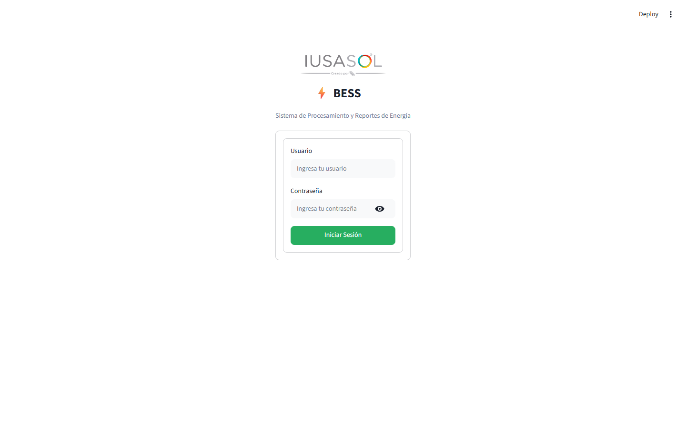
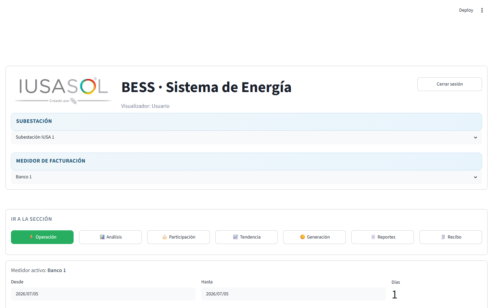
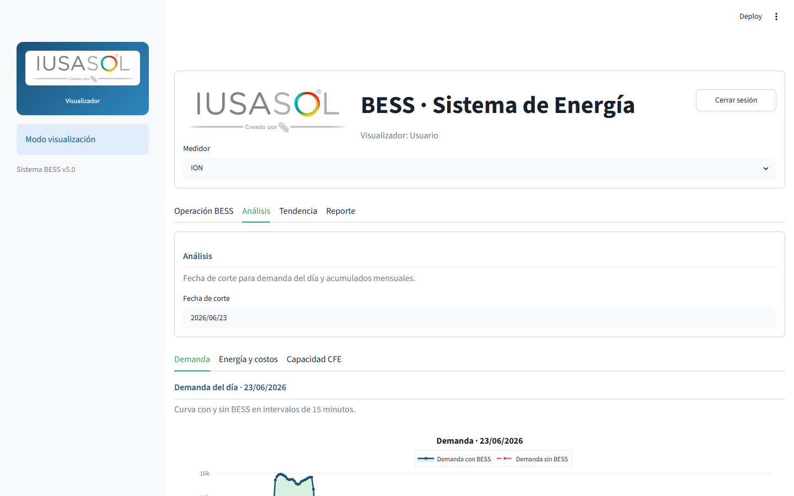
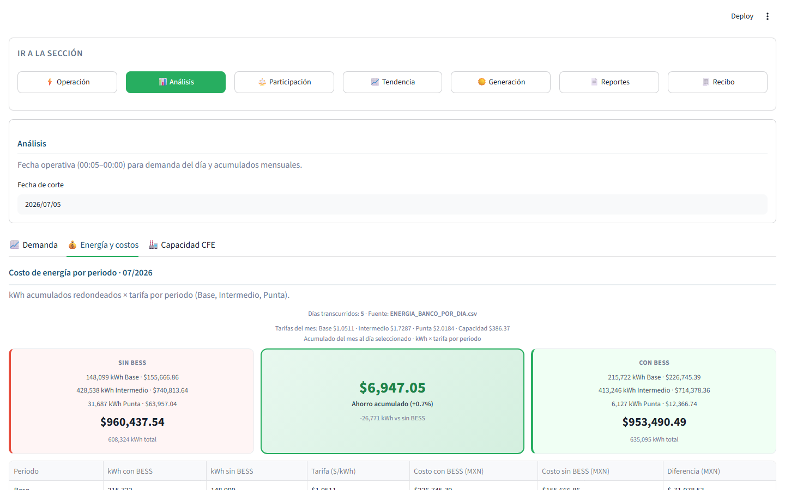
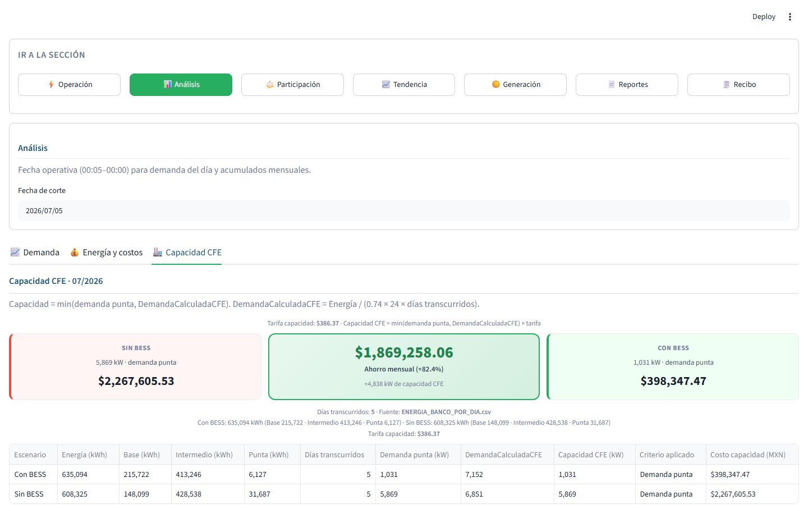
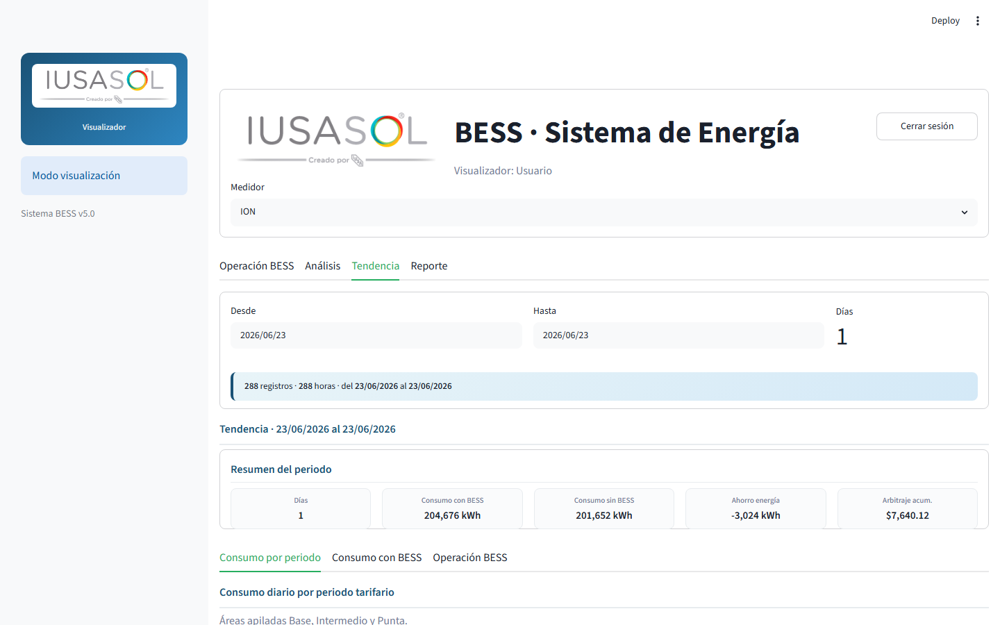
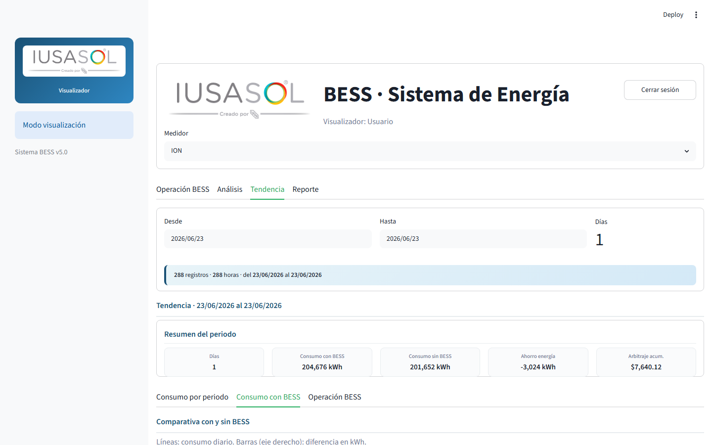
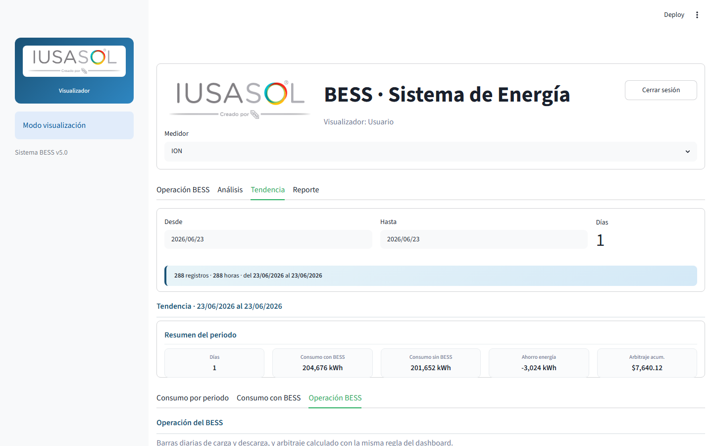
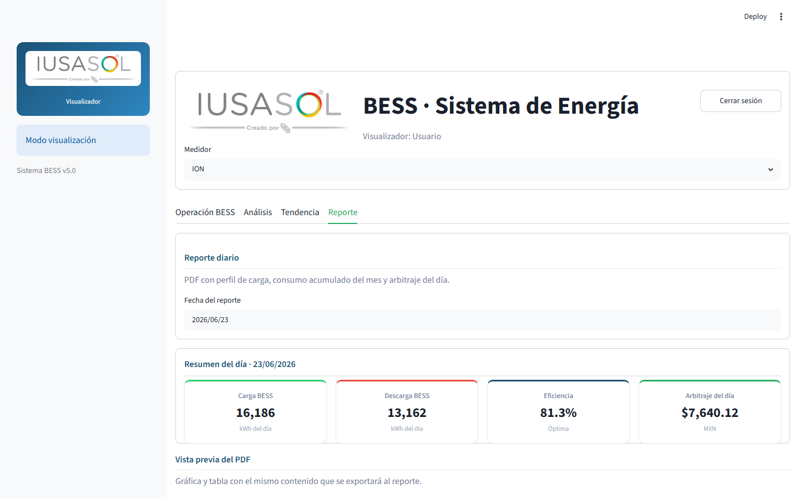

# Guía de usuario — Sistema BESS

**Versión:** 5.15.0  
**Aplicación:** Monitoreo, análisis y reportes de sistemas BESS para subestaciones **IUSA 1**, **IUSA 2** e **IUSA ARAGON**.

> **PDF con capturas:** `docs/GUIA_USUARIO.pdf`  
> **Regenerar** (app en `http://localhost:8501`): `python docs/generar_guia_pdf.py`  
> **Administradores:** ver [GUIA_ADMINISTRADOR.md](GUIA_ADMINISTRADOR.md)

---

## 1. Introducción

El sistema BESS permite consultar la operación diaria y mensual de la batería, comparar escenarios **con BESS** y **sin BESS**, estimar costos de energía y capacidad según tarifas CFE, atribuir participación en capacidad (Shapley), revisar generación y generar **reportes PDF** diarios y acumulados.

Los datos provienen de archivos CSV procesados a partir de mediciones de planta (demanda, carga/descarga BESS, energía por periodo tarifario). El administrador ejecuta el pipeline de sincronización y reportes; usted consulta los resultados en el **reporteador**.

---

## 2. Acceso al sistema

### 2.1 Inicio de sesión

Al abrir la aplicación se muestra la pantalla de acceso con el **logo IUSASOL**, el título **BESS · Sistema de Energía** y el formulario de usuario y contraseña.

  
*Figura 1 — Pantalla de inicio de sesión*

### 2.2 Roles

| Rol | Experiencia |
|-----|-------------|
| **Visualizador** (`user`) | Solo reporteador a pantalla completa; **sin barra lateral**. |
| **Operador** (`admin`) | Reporteador + barra lateral con pipeline de datos. |
| **Superadmin** | Igual que operador + catálogo y mantenimiento de base de datos. |

Use **Cerrar sesión** (esquina superior derecha) al terminar.

---

## 3. Elementos comunes de la interfaz

### 3.1 Cabecera

- Logo IUSASOL y título **BESS · Sistema de Energía**
- Nombre del usuario y rol
- Botón **Cerrar sesión**

### 3.2 Subestación y medidor

Debajo de la cabecera:

| Control | Función |
|---------|---------|
| **Subestación** | IUSA 1, IUSA 2 o IUSA ARAGON |
| **Medidor de facturación** | Medidor ION/testigo de consumo de esa subestación |

Todas las secciones y gráficas usan el par subestación + medidor seleccionado.

### 3.3 Navegación por secciones

Botones horizontales **Ir a la sección** (no pestañas del navegador):

| Botón | Contenido |
|-------|-----------|
| ⚡ **Operación** | Resumen, perfil de carga, arbitraje |
| 📊 **Análisis** | Demanda, energía/costos, capacidad CFE |
| ⚖️ **Participación** | Shapley generación vs BESS *(solo subestaciones que lo soportan)* |
| 📈 **Tendencia** | Histórico de consumo y operación BESS |
| ☀️ **Generación** | Energía del recurso de generación *(si aplica)* |
| 📄 **Reportes** | PDF diario y reporte acumulado |
| 🧾 **Recibo** | Recibo CFE estimado con/sin BESS |
| 🌿 **Emisiones** | Huella Scope 2 con/sin BESS y PDF |

Pase el cursor sobre un botón ~2 segundos para ver una ayuda flotante con descripción y capacidades.

### 3.4 Selectores de fecha

| Tipo | Secciones | Uso |
|------|-----------|-----|
| **Rango** (Desde / Hasta) | Operación, Tendencia | Uno o varios días |
| **Fecha única** | Análisis, Reportes, Recibo, Emisiones | Día de corte o del PDF |

Por defecto suele proponerse el **día anterior**, dentro del rango de datos disponibles.

### 3.5 Periodos tarifarios

| Periodo | Uso |
|---------|-----|
| **Base** | Energía y demanda en horario base |
| **Intermedio** | Horario intermedio |
| **Punta** | Horario punta (crítico para capacidad CFE) |

Las tarifas ($/kWh y $/kW capacidad) se leen del catálogo según el **mes** de la fecha seleccionada.

### 3.6 Actualización automática

La app recarga cada **15 minutos** para reflejar datos nuevos sin cerrar sesión.

---

## 4. Sección «Operación»

Vista principal de operación BESS para el rango elegido.

  
*Figura 2 — Operación: resumen, perfil de carga y arbitraje*

### 4.1 Resumen del periodo

| Indicador | Qué muestra | Cálculo |
|-----------|-------------|---------|
| **Carga BESS** | Energía absorbida (kWh) | Suma `KWH_REC_BESS` en el rango |
| **Descarga BESS** | Energía entregada (kWh) | Suma `KWH_ENT_BESS` |
| **Eficiencia** | Descarga ÷ Carga (%) | «Óptima» si ≥ 80 % |
| **Arbitraje** | Beneficio (MXN) | Ver [§12 Arbitraje](#12-arbitraje-beneficio-económico) |

### 4.2 Perfil de carga

Potencia (kW) en el tiempo:

| Serie | Significado |
|-------|-------------|
| **IUSA Con BESS** | Demanda neta con batería |
| **Carga BESS** | Potencia de carga (positiva) |
| **Descarga BESS** | Potencia de descarga (negativa en gráfica) |
| **Generación** | Curva de generación si la subestación tiene recurso *(perfil y PDF)* |

Un día: eje por **hora**. Varios días: **máximo diario** por serie.

### 4.3 Tabla de energía por periodo

Incluye consumo, demanda rolada (kW), fila **Generación Acumulada** (kWh) cuando aplica, carga/descarga BESS y arbitraje por periodo.

### 4.4 Arbitraje por periodo

Tarjetas Base, Intermedio, Punta y Total para el rango seleccionado.

---

## 5. Sección «Análisis»

Fecha de corte única; acumulados del **mes calendario** hasta ese día.

Sub-pestañas internas: **Demanda**, **Energía y costos**, **Capacidad CFE**.

### 5.1 Demanda

  
*Figura 3 — Demanda del día (15 min) y demanda máxima del mes*

- Gráfica **con BESS** vs **sin BESS** (intervalos 15 min).
- Demanda rodante reiniciada al inicio de cada mes operativo (00:05 y 00:10 en cero; primer valor a 00:15).
- Tabla de picos mensuales por periodo (kW y hora del pico).

### 5.2 Energía y costos

  
*Figura 4 — Costo de energía acumulado del mes*

```
Costo periodo (MXN) = kWh del periodo (redondeado) × Tarifa del mes ($/kWh)
```

Comparación con/sin BESS, ahorro acumulado (MXN y %) y gráfica de barras.

### 5.3 Capacidad CFE

  
*Figura 5 — Criterio de capacidad CFE*

```
DemandaCalculadaCFE = Energía mes (kWh) ÷ (0,74 × 24 × días transcurridos)
Capacidad CFE (kW) = mín(Demanda punta , DemandaCalculadaCFE)
Costo capacidad = Capacidad × Tarifa capacidad del mes
```

Comparación con/sin BESS. El ahorro aquí es **solo ION + BESS**; no incluye participación Shapley de generación.

---

## 6. Sección «Participación Capacidad»

Disponible en subestaciones que soportan el cálculo Shapley (IUSA 1 e IUSA 2).

Muestra atribución de la **reducción de capacidad CFE** entre **generación** y **BESS** (escenarios D0–Dcb, kW y MXN).

> Esta atribución es **informativa** en esta sección. No modifica las cifras de la pestaña Capacidad CFE ni los totales de ahorro del resto de la app.

---

## 7. Sección «Tendencia»

Análisis histórico en rango de fechas.

  
*Figura 6 — Consumo diario por periodo tarifario*

| Sub-pestaña | Contenido |
|-------------|-----------|
| **Consumo por periodo** | Áreas apiladas Base / Intermedio / Punta |
| **Consumo con BESS** | Líneas con/sin BESS y ahorro diario |
| **Operación BESS** | Carga, descarga y arbitraje diario |

 · 

---

## 8. Sección «Generación»

Visible si la subestación tiene recurso de generación (IUSA 1, IUSA 2, IUSA ARAGON, etc.).

Energía por periodo, acumulado mensual y gráfica diaria. La fila **Generación Acumulada** en tablas de energía es referencia en kWh, no sustituye el ahorro de capacidad BESS en otras pantallas.

---

## 9. Sección «Reportes»

  
*Figura 7 — Reporte diario y vista previa PDF*

### 9.1 Reporte diario

- Seleccione **fecha del reporte**.
- Opción **Incluir generación en el perfil del PDF** (subestaciones con generación).
- Vista previa: KPIs, perfil, tabla de energía, arbitraje.
- Descarga PDF oficial del día.

### 9.2 Reporte acumulado

Resumen de ahorros BESS en el periodo (demanda, energía, capacidad). El PDF acumulado puede mostrar la parte Shapley **solo del BESS**, no de generación.

---

## 10. Sección «Recibo CFE»

Recibo mensual estimado **con BESS** y **sin BESS**: energía, capacidad, factor de potencia y cargos según tarifas vigentes. Descarga en PDF.

---

## 11. Sección «Emisiones»

Reporte mensual de emisiones de CO₂ hasta la fecha de corte:

- comparación **Con BESS vs Sin BESS** por periodo tarifario;
- huella mensual total;
- energía de red y generación local;
- beneficio o incremento de emisiones atribuible a la operación;
- descarga en PDF con factores de emisión y referencias.

Las gráficas muestran el título y la leyenda en bandas separadas para mantener
legibles las series. Si cambian datos históricos mediante una importación o
Rebuild, Emisiones y Recibo CFE se recalculan a partir de los reportes diarios
regenerados; sus fórmulas no cambian.

---

## 12. Arbitraje (beneficio económico)

**Método principal** (con datos sin BESS):

```
Arbitraje por periodo = Costo sin BESS − Costo con BESS
Arbitraje total       = Suma Base + Intermedio + Punta
```

**Respaldo** (sin columnas sin BESS):

```
Arbitraje periodo = (kWh descarga − kWh carga) × Tarifa del periodo
```

Valor positivo = ahorro; negativo = mayor costo con BESS en ese periodo.

---

## 13. Reglas de redondeo

| Magnitud | Regla |
|----------|--------|
| **kWh** | Entero más cercano (≥ 0,5 sube) |
| **Costos energía (MXN)** | 2 decimales, redondeo matemático |
| **Demanda / capacidad (kW)** | Redondeo hacia arriba al entero |
| **Costo capacidad (MXN)** | Redondeo hacia arriba a 2 decimales |

---

## 14. Fuentes de datos (referencia)

| Archivo | Contenido |
|---------|-----------|
| `COMBINADO_POR_MINUTO_{Medidor}_{Sub}.csv` | Series minuto a minuto |
| `ENERGIA_{Medidor}_{Sub}_POR_DIA.csv` | Energía diaria por periodo |
| `ENERGIA_BESS_{Sub}_POR_DIA.csv` | Carga/descarga BESS por día |
| `ENERGIA_Generacion_{Sub}_POR_DIA.csv` | Generación diaria |
| `ACUMULADOS_{Medidor}_{Sub}.csv` | Acumulados mensuales |
| Catálogo SQLite / `Tarifas_*.csv` | Tarifas mensuales |

---

## 15. Preguntas frecuentes

**¿Por qué no veo Participación o Generación?**  
Esas secciones se ocultan automáticamente si la subestación seleccionada no aplica.

**¿Por qué el consumo «mensual» en un solo día?**  
En vista de un día, la fila de consumo es el acumulado del **mes natural** hasta esa fecha.

**¿Por qué no hay comparación sin BESS?**  
Los CSV deben incluir columnas `*_SIN_BESS`. Contacte al administrador.

**¿No hay gráficas?**  
El administrador debe ejecutar **Procesar todo** (o el pipeline paso a paso). Si usted es visualizador, verá un mensaje para contactar al administrador.

**¿Qué significa “el reporte mostrado no incluye los datos ya sincronizados”?**  
La app detectó más de 3 horas entre la última sincronización y el CSV mostrado.
Un operador debe ejecutar **Procesar todo**. Si persiste, un superadmin debe
reconciliar SQLite con Fuente y reconstruir la cadena CSV.

**¿Por qué una gráfica histórica sigue en cero después de importar datos?**  
Importar actualiza SQLite. Para reflejar una corrección histórica en gráficas,
Recibo, Emisiones y PDFs también debe ejecutarse **Rebuild CSV** o regenerar los
reportes. Esta operación es exclusiva del superadmin.

**¿El arbitraje del dashboard y el PDF diario coinciden?**  
Sí, para **un solo día** en Operación. En rangos de varios días, Operación integra todo el periodo.

---

## 16. Soporte

Problemas de acceso o datos faltantes: contacte al **administrador del sistema**.  
Documentación técnica: [INDICE_DOCUMENTACION.md](INDICE_DOCUMENTACION.md).

---

*Documento para usuarios del sistema BESS — IUSASOL.*
