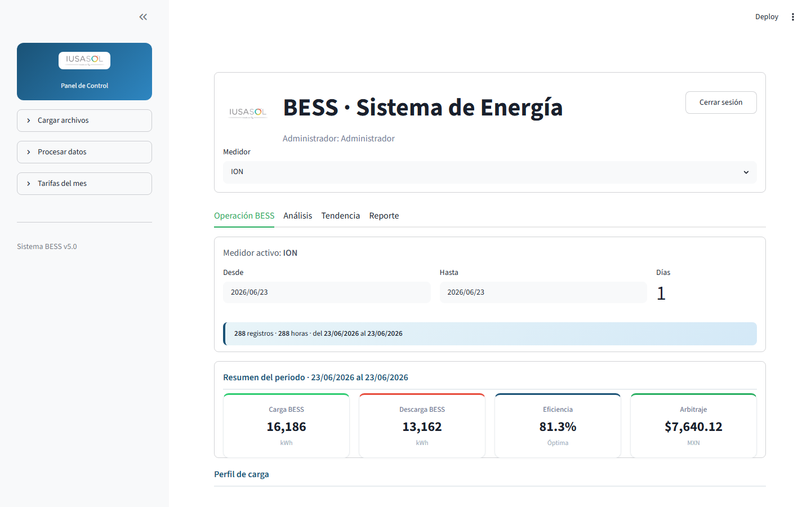

# Guía de usuario — Sistema BESS

**Versión:** 5.0  
**Aplicación:** Monitoreo, análisis y reportes de sistemas de almacenamiento de energía (BESS) para medidores **ION** y **BANCO**.

> **PDF con capturas:** `docs/GUIA_USUARIO.pdf`  
> **Regenerar** (con la app en `http://localhost:8501`): `python docs/generar_guia_pdf.py`

---

## 1. Introducción

El sistema BESS permite consultar la operación diaria y mensual de la batería, comparar escenarios **con BESS** y **sin BESS**, estimar costos de energía y capacidad según tarifas CFE, y generar **reportes PDF diarios**.

Los datos provienen de archivos CSV procesados a partir de mediciones de planta (demanda, carga/descarga BESS, energía por periodo tarifario).

---

## 2. Acceso al sistema

### 2.1 Inicio de sesión

Al abrir la aplicación se muestra la pantalla de acceso. Ingrese **usuario** y **contraseña** asignados por el administrador.


*Figura 1 — Pantalla de inicio de sesión*

### 2.2 Roles

| Rol | Permisos |
|-----|----------|
| **Usuario (visualizador)** | Consulta todas las pestañas, gráficas, tablas y descarga reportes PDF. La barra lateral aparece colapsada por defecto. |
| **Administrador** | Todo lo anterior, más carga de archivos fuente, procesamiento de datos, regeneración de reportes CSV y consulta de tarifas en el panel lateral. |

Use **Cerrar sesión** (esquina superior derecha) al terminar.

---

## 3. Elementos comunes de la interfaz

### 3.1 Selector de medidor

En la parte superior puede elegir el medidor activo:

- **ION**
- **BANCO**

Todas las pestañas muestran información del medidor seleccionado.

### 3.2 Selectores de fecha

Hay dos tipos de selector:

| Tipo | Dónde se usa | Qué define |
|------|--------------|------------|
| **Rango de fechas** (Desde / Hasta) | Operación BESS, Tendencia | Periodo de análisis con uno o varios días. |
| **Fecha única** (Fecha de corte / Fecha del reporte) | Análisis, Reporte | Un solo día como referencia. |

Por defecto suele proponerse el **día anterior** al actual, dentro del rango de datos disponibles.

### 3.3 Periodos tarifarios

Los cálculos de energía y costos se desglosan en tres periodos CFE:

| Periodo | Uso en la app |
|---------|----------------|
| **Base** | Energía y demanda en horario base. |
| **Intermedio** | Energía y demanda en horario intermedio. |
| **Punta** | Energía y demanda en horario punta (crítico para capacidad CFE). |

Las **tarifas** ($/kWh por periodo y $/kW de capacidad) se leen del archivo `Tarifas_2026.csv` según el **mes** de la fecha seleccionada.

---

## 4. Pestaña «Operación BESS»

Vista principal de operación para el rango de fechas elegido.


*Figura 2 — Operación BESS: resumen, perfil de carga y arbitraje*

### 4.1 Resumen del periodo (tarjetas)

| Indicador | Qué muestra | Cómo se calcula |
|-----------|-------------|-----------------|
| **Carga BESS** | Energía absorbida por la batería en el rango (kWh). | Suma de `KWH_REC_BESS` en datos minuto a minuto del rango. |
| **Descarga BESS** | Energía entregada por la batería (kWh). | Suma de `KWH_ENT_BESS` en el mismo rango. |
| **Eficiencia** | Relación descarga/carga (%). | `(Descarga ÷ Carga) × 100`. Se indica «Óptima» si ≥ 80 %. |
| **Arbitraje** | Beneficio económico del periodo (MXN). | Ver sección [Arbitraje](#8-arbitraje-beneficio-económico). |

### 4.2 Gráfica «Perfil de carga»

Muestra potencia (kW) en el tiempo:

| Serie | Significado |
|-------|-------------|
| **IUSA Con BESS** | Demanda neta de la instalación con batería operando. |
| **Carga BESS** | Potencia de carga de la batería (valores positivos). |
| **Descarga BESS** | Potencia de descarga (se grafica en negativo para distinguirla). |

**Un solo día:** eje horizontal por **hora** (curvas continuas).  
**Varios días:** eje horizontal por **día**, mostrando el **máximo diario** de cada serie.

### 4.3 Tabla «Detalle de energía por periodo»

Filas principales:

| Fila | Contenido |
|------|-----------|
| **Consumo mensual / del periodo (kWh)** | Energía recibida por periodo (Base, Intermedio, Punta). Si el rango es un solo día, muestra acumulado **mensual** a ese día; si es rango múltiple, suma del periodo seleccionado. |
| **Demanda rolada (kW)** | Demanda máxima registrada por periodo al **último día** del rango (desde acumulados). |
| **Carga BESS del periodo (kWh)** | Energía cargada en la batería por periodo tarifario. |
| **Descarga BESS del periodo (kWh)** | Energía descargada por periodo. |
| **Arbitraje de energía (MXN)** | Ahorro por periodo y total. |

### 4.4 Tarjetas de arbitraje por periodo

Desglose del arbitraje en **Base**, **Intermedio**, **Punta** y **Total** para el rango seleccionado.

---

## 5. Pestaña «Análisis»

Análisis con **fecha de corte** única. Los acumulados son **del mes calendario** hasta ese día (no el rango completo de la pestaña Operación).

Contiene tres sub-pestañas:

### 5.1 Demanda


*Figura 3 — Demanda del día (15 min) y demanda máxima del mes*

#### Gráfica «Demanda del día»

- Compara **demanda con BESS** y **demanda sin BESS** en intervalos de **15 minutos**.
- Fuente: columnas `IUSA_CON_BESS_*_kW_DEM_15min` e `IUSA_SIN_BESS_*_kW_DEM_15min`.
- Permite ver cómo la batería modifica el perfil de demanda hora a hora.

#### Tabla «Demanda máxima del mes»

- Para cada periodo (Base, Intermedio, Punta): valor máximo de demanda (kW) y **hora del pico** en el mes, con y sin BESS.
- Fuente: archivo `ACUMULADOS_{ION|BANCO}.csv`.

### 5.2 Energía y costos


*Figura 4 — Costo de energía acumulado del mes*

Compara el **costo acumulado de energía del mes** (al día de corte) **con BESS** vs **sin BESS**.

**Cálculo por periodo:**

```
Costo periodo (MXN) = kWh del periodo (redondeado) × Tarifa del mes ($/kWh)
```

- **Con BESS:** columnas `BASE_REC`, `INTERMEDIO_REC`, `PUNTA_REC`.
- **Sin BESS:** columnas `BASE_REC_SIN_BESS`, `INTERMEDIO_REC_SIN_BESS`, `PUNTA_REC_SIN_BESS`.

Fuente: `ENERGIA_{ION|BANCO}_POR_DIA.csv`.

El panel central muestra:

- **Ahorro acumulado** = Costo sin BESS − Costo con BESS (MXN y %).
- **Diferencia en kWh** entre ambos escenarios.

Incluye tabla detallada y gráfica comparativa de barras (en expander).

> **Nota:** Si no existen columnas «sin BESS», la app muestra un aviso y solo presenta el escenario con batería.

### 5.3 Capacidad CFE


*Figura 5 — Criterio de capacidad CFE*

Estima el cargo por **capacidad** según el criterio de CFE para el mes al día seleccionado.

**Paso 1 — Dos criterios de demanda (kW):**

| Criterio | Fórmula |
|----------|---------|
| **Demanda punta** | Demanda rolada máxima en horario punta del mes (kW, redondeo hacia arriba). |
| **DemandaCalculadaCFE** | `Energía total del mes (kWh) ÷ (0,74 × 24 × días transcurridos)` |

El factor **0,74** es el factor de planta CFE para este cálculo.

**Paso 2 — Capacidad facturable:**

```
Capacidad CFE (kW) = mínimo( Demanda punta , DemandaCalculadaCFE )
```

**Paso 3 — Costo:**

```
Costo capacidad (MXN) = Capacidad CFE (kW) × Tarifa capacidad del mes ($/kW)
```

(Costo redondeado hacia arriba a 2 decimales.)

Se comparan escenarios **con BESS** y **sin BESS**, con gráfica de barras y tabla de criterios aplicados.

---

## 6. Pestaña «Tendencia»


*Figura 6 — Tendencia histórica por rango de fechas*

Análisis histórico en un **rango de fechas** (días consecutivos).

### 6.1 Resumen del periodo

Métricas agregadas del rango:

- Días analizados.
- Consumo con/sin BESS (si hay datos sin BESS).
- Ahorro de energía (kWh).
- Arbitraje acumulado (MXN).
- Promedio diario de consumo.
- Carga BESS acumulada.

### 6.2 Sub-pestaña «Consumo por periodo»

**Gráfica de áreas apiladas:** consumo diario en kWh por Base, Intermedio y Punta.

**Línea punteada:** promedio móvil de **7 días** del consumo total (solo si hay más de 7 días en el rango).

### 6.3 Sub-pestaña «Con vs sin BESS»

- **Líneas:** consumo diario total con BESS y sin BESS.
- **Barras (eje derecho):** diferencia diaria en kWh (sin BESS − con BESS).
- **Métricas inferiores:** costo acumulado del rango con BESS, sin BESS y ahorro en MXN.

Requiere columnas de energía sin BESS en el archivo diario.

### 6.4 Sub-pestaña «Operación BESS»

**Gráfica de barras diarias:**

- Carga y descarga BESS por día (desde `ENERGIA_BESS_POR_DIA.csv`).

**Gráfica de arbitraje diario:**

- Barra por día con el arbitraje calculado con la misma regla del dashboard.

**Métricas:** carga acumulada, descarga acumulada y eficiencia BESS del rango.

---

## 7. Pestaña «Reporte»


*Figura 7 — Vista previa y generación del PDF diario*

Generación del **reporte PDF diario**.

### 7.1 Selector

Elija la **fecha del reporte** (un día).

### 7.2 Vista previa

Muestra lo mismo que irá al PDF:

- KPIs del día (carga, descarga, eficiencia, arbitraje).
- Gráfica de perfil de carga del día.
- Tabla de detalle de energía (acumulado mensual al día + arbitraje del día).
- Tarjetas de arbitraje por periodo.

### 7.3 Botón «Generar Reporte Diario»

Descarga un archivo PDF con el reporte oficial del día para el medidor activo.

---

## 8. Arbitraje (beneficio económico)

El **arbitraje** representa el ahorro económico atribuible al BESS.

### Método principal (cuando hay datos sin BESS)

```
Arbitraje por periodo = Costo sin BESS − Costo con BESS
Arbitraje total       = Suma de periodos (Base + Intermedio + Punta)
```

Los costos usan kWh redondeados al entero más cercano × tarifa del mes.

### Método alternativo (respaldo)

Si no hay comparación sin BESS:

```
Arbitraje periodo = (kWh descarga − kWh carga) × Tarifa del periodo
```

Datos de carga/descarga desde `ENERGIA_BESS_POR_DIA.csv`.

Un valor **positivo** indica ahorro; **negativo** indica que el costo con BESS fue mayor en ese periodo.

---

## 9. Reglas de redondeo

| Magnitud | Regla |
|----------|--------|
| **kWh** (visualización y base de costos de energía) | Entero más cercano (≥ 0,5 sube). |
| **Costos de energía (MXN)** | 2 decimales, redondeo matemático. |
| **Demanda / capacidad (kW)** | Redondeo **hacia arriba** al entero. |
| **Costo de capacidad (MXN)** | Redondeo **hacia arriba** a 2 decimales. |

---

## 10. Fuentes de datos (referencia)

| Archivo | Contenido |
|---------|-----------|
| `COMBINADO_POR_MINUTO_{ION\|BANCO}.csv` | Series minuto a minuto: demanda, carga/descarga BESS. |
| `ENERGIA_{ION\|BANCO}_POR_DIA.csv` | Energía diaria por periodo, con y sin BESS. |
| `ENERGIA_BESS_POR_DIA.csv` | Carga y descarga BESS por periodo y día. |
| `ACUMULADOS_{ION\|BANCO}.csv` | Acumulados mensuales: energía, demandas máximas. |
| `Tarifas/Tarifas_2026.csv` | Tarifas mensuales Base, Intermedio, Punta y Capacidad. |

El administrador regenera estos archivos desde el panel lateral (**Verificar → Filtrar → Generar reportes**).

---

## 11. Panel del administrador (solo rol admin)


*Figura 8 — Panel lateral del administrador*

| Opción | Función |
|--------|---------|
| **Cargar archivos** | Sube CSV fuente (ION, BESS, Banco1) a la carpeta de archivos fuente. |
| **Verificar** | Valida que los archivos fuente estén completos y sean consistentes. |
| **Filtrar** | Procesa y filtra datos crudos. |
| **Generar reportes** | Genera/actualiza CSV de reporte para ION y BANCO. |
| **Procesar todo** | Ejecuta verificación, filtrado y generación en secuencia. |
| **Tarifas del mes** | Muestra tarifas vigentes del mes actual. |

---

## 12. Interpretación rápida — preguntas frecuentes

**¿Por qué el consumo «mensual» en un reporte de un solo día?**  
En vista de un día, la fila de consumo refleja lo acumulado del **mes natural** hasta esa fecha, no solo las horas de ese día.

**¿Por qué no veo comparación sin BESS?**  
Los CSV deben incluir columnas `*_SIN_BESS`. El administrador debe reprocesar los datos.

**¿La eficiencia puede superar 100 %?**  
En condiciones reales no debería; valores altos o > 100 % sugieren revisar datos o periodos con poca carga.

**¿El arbitraje del dashboard y el del reporte diario son iguales?**  
Para **un solo día** seleccionado en Operación BESS, coinciden con el reporte de esa fecha. En rangos de varios días, el dashboard suma/integra el periodo completo.

---

## 13. Soporte

Para problemas de acceso, datos faltantes o discrepancias en cifras, contacte al **administrador del sistema**, quien puede volver a procesar archivos fuente y validar tarifas del mes.

---

*Documento generado para usuarios del sistema BESS — IUSASOL.*
